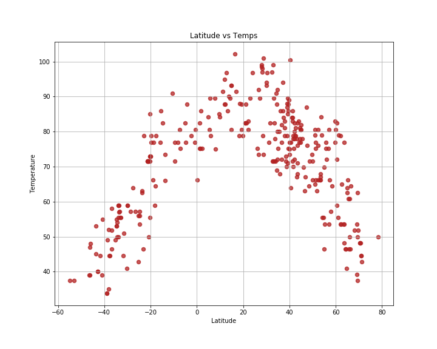
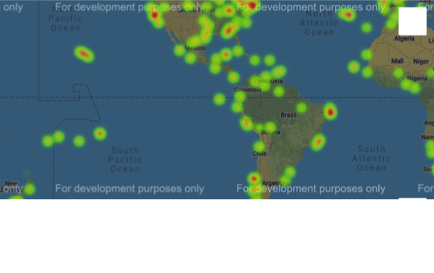

## World Weather Analysis 

### About
Global temperatures, humidity, cloud cover percentages and windspeed readings graphed and mapped. 

This project utilizes the API from Open Weather along with Google maps to analyze global weather

Some of the visualizations were used in this "sister" site: 
 <'https://sherirosalia.github.io/Visualization_Website/'>Link</a>

### Frameworks and Dependencies
Python Pandas
Jupyter Notebook
Matplotlib
Google Maps

### File Structure
Code is in global_weather_analysis.ipynb
Visualizations are in images folder.
CSV file is data obtained from API

### Visualizations

